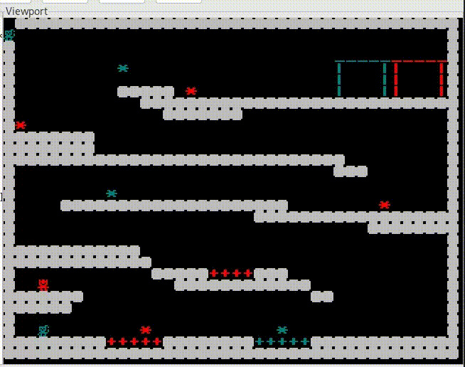

# Fireboy and Watergirl

<div align ="center">
  
</div>

## Description

&nbsp;&nbsp;&nbsp;&nbsp;This repository contains the implementation of the Fireboy and Watergirl game in Assembly for the São Carlos Institute of Mathematical and Computing Sciences (ICMC) processor. To simulate the game on your machine, follow the instructions in the repository [Processador ICMC](https://github.com/simoesusp/Processador-ICMC/blob/master/Install_Packages/) compatible with Windows, Linux and MacOS.

## Starting the game

&nbsp;&nbsp;&nbsp;&nbsp;To start the game, copy and paste the file **(sim)** and **(montador)** generated in the instructions present in [Processador ICMC](https://github.com/simoesusp/Processador-ICMC/blob/master/Install_Packages/), according to your machine's operating system, and replace them in the game folder. Afterwards, use the following commands to assemble and run the game simulation:

```
./montador Game.asm Game.mif
./sim Game.mif charmap.mif
```

## Controls

&nbsp;&nbsp;&nbsp;&nbsp;The game has two characters that are controlled by the following keyboard keys:

- Fireboy movement:

&nbsp;&nbsp;&nbsp;&nbsp;W - Jump

&nbsp;&nbsp;&nbsp;&nbsp;A - Left

&nbsp;&nbsp;&nbsp;&nbsp;D - Right

- Watergirl movement:

&nbsp;&nbsp;&nbsp;&nbsp;I - Jump

&nbsp;&nbsp;&nbsp;&nbsp;J - Left

&nbsp;&nbsp;&nbsp;&nbsp;L - Right

## Objective

&nbsp;&nbsp;&nbsp;&nbsp; The objective of the game is to reach the door with both characters to progress to the next level. However, there is an additional challenge: the player controlling Fireboy must avoid the water, while the player controlling Watergirl must dodge the lava spread across the stage. If one of the players touches an area prohibited to their respective character, the phase will be restarted for a new attempt.

## Contributions

&nbsp;&nbsp;&nbsp;&nbsp;This project was developed as an evaluation method for the discipline SSC0902 - Computer Organization and Architecture, at the University of São Paulo. The project is open for any improvement.

## Develop by

[Andre Jacob Suaide](https://github.com/eletrojacob)

[Felipe Aparecido da Silva](https://github.com/FehASilva)

[Gustavo Carvalho Araujo](https://www.linkedin.com/in/guaraujoc/)

[Henrique de Oliveira Araujo](https://github.com/HerbGlrt)

[Marcus Vinicius da Silva](https://github.com/MarcussSilva)

[Oliver Kenzo Kobayashi](https://www.instagram.com/_okobayashi/)

[Rodrigo Rodrigues de Castro](https://github.com/rodrigorcz)

[Viktor Sergio Ferreira](https://github.com/Viktor-S-Ferreira)

[Vitor Augusto Paiva de Brito](https://github.com/vtpaiva)

[Yazid Alamou Bouari](https://github.com/Iambouari)

## License

&nbsp;&nbsp;&nbsp;&nbsp;This program is under license [MIT License](https://opensource.org/licenses/MIT).
